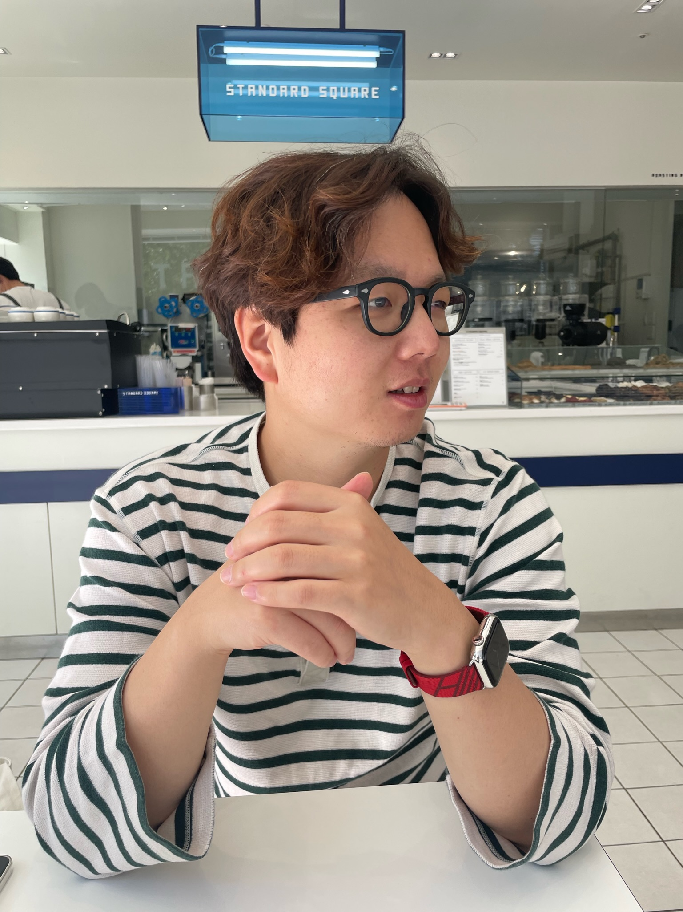

### 임준규
* juniqlim@gmail.com
* [github](https://github.com/juniqlim), [twitter](https://twitter.com/juniq1im), [blog](https://juniq.tistory.com)

[익스트림 프로그래밍](https://en.wikipedia.org/wiki/Extreme_programming)을 좋아하는 프로그래머 입니다.  

[애자일 선언문](https://agilemanifesto.org/iso/ko/manifesto.html) 선언자들의 조언을 좋아합니다.  
[엘레강트 오브젝트](https://www.aladin.co.kr/shop/wproduct.aspx?ItemId=258374007) 책과 저자인
[Yegor Bugayenko](https://www.yegor256.com/)의 영향을 많이 받았습니다. 

대부분의 경력기간동안, Java, Spring(Boot), RDB로 애플리케이션 서버 만드는 일을 해왔습니다.

TDD방식으로, 객체지향적으로, 선언적으로 프로그래밍하는 것을 좋아합니다.  
프로그램을 만드는 더 나은 방법을 고민하다가 찾은, 현재 저의 답입니다.

언제나 즐겁게 프로그래밍하는 것이, 단기적/장기적 목표입니다.
 
## 경력

* [한패스](https://hanpass.com) (2020.01 ~ 현재)
  * Spring Batch를 사용한 배치 개발
  * 대외연계(오픈뱅킹, 쿠콘, 유니온페이등)를 위한 서버, 모듈 개발
  * APM툴 도입, JPA 성능개선, Slow Query 개선
  * 배포 자동화, 프레임워크 업데이트, 테스트 코드 작성등 더 나은 생산성을 위해 여러 시도 중
* [링크올](https://www.rocketpunch.com/companies/linkall) (2019.01 ~ 2020.01)
  * 데이터교환 국제표준(FHIR)을 만족하는 [EMR](https://namu.wiki/w/EMR)(의료기록시스템) 초기설계
  * [나래의료재단](https://booking.naraemedic.com/medical/supplies/)에서 사용할 검진프로그램 개발 
* 프리랜서 (2017.04 ~ 2018.12)
  * 11번가 전시파트 이벤트 개발 유지보수
  * SSF몰 UIUX 리뉴얼 전시파트 개발
  * SKT Infra manager admin web 개발 
* [네트빌](https://www.netville.co.kr/) (2007.12 ~ 2016.12)
  * 솔루션SI 회사에서 외주개발자로 근무
  * 모델1 방식 프로젝트를 시작으로 대부분 Spring 프로젝트를 수행
  * SK엔카닷컴에 4년정도 파견근무하며, 서비스 회사의 업무를 경험

